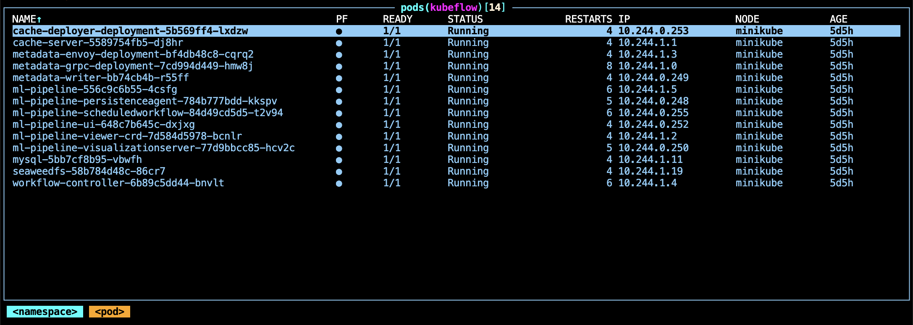
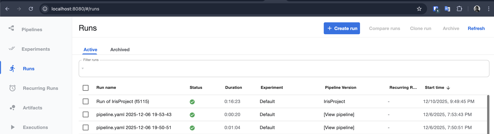
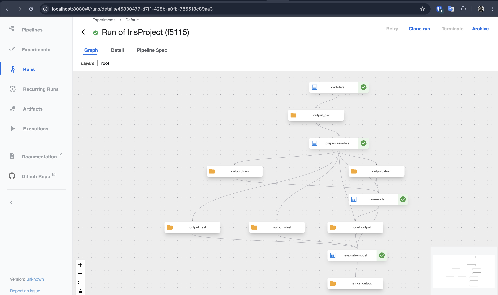
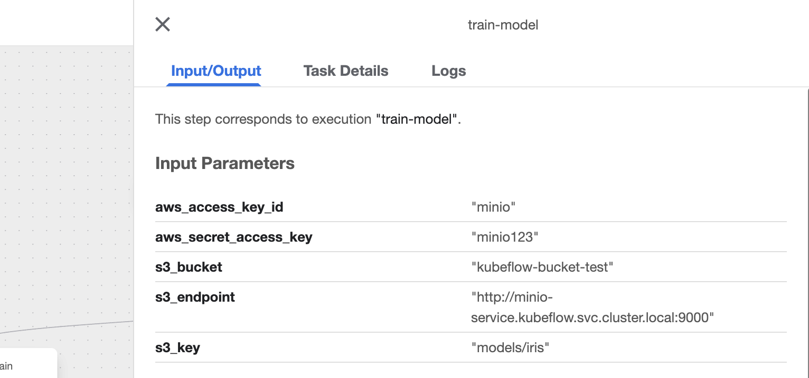
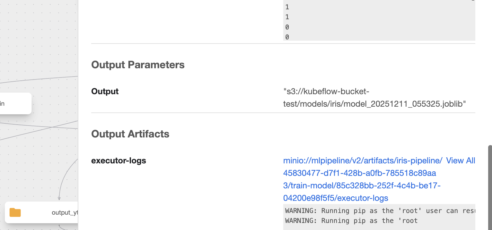
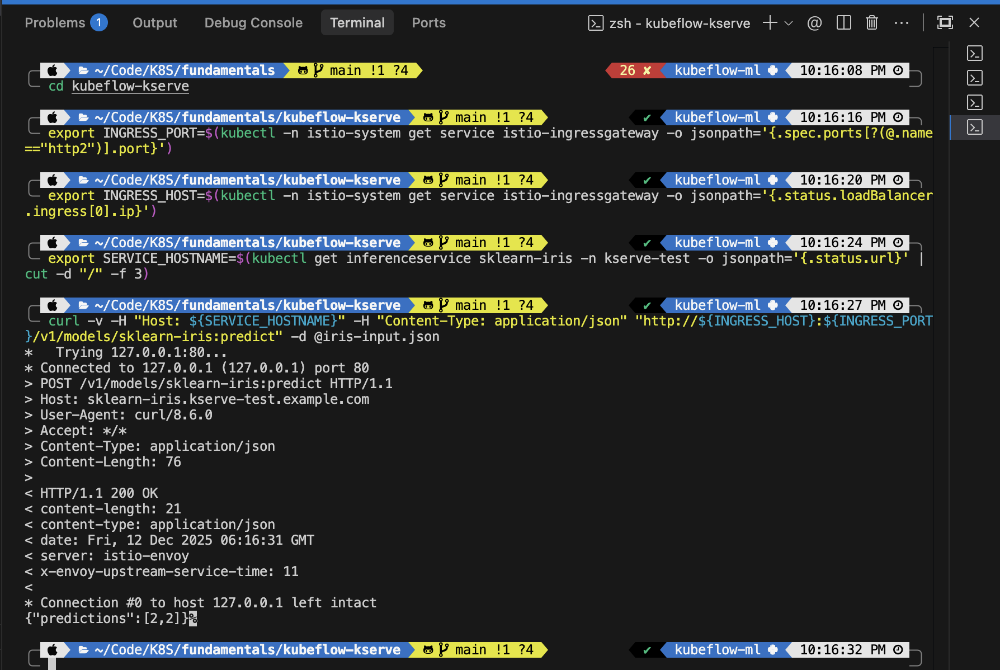
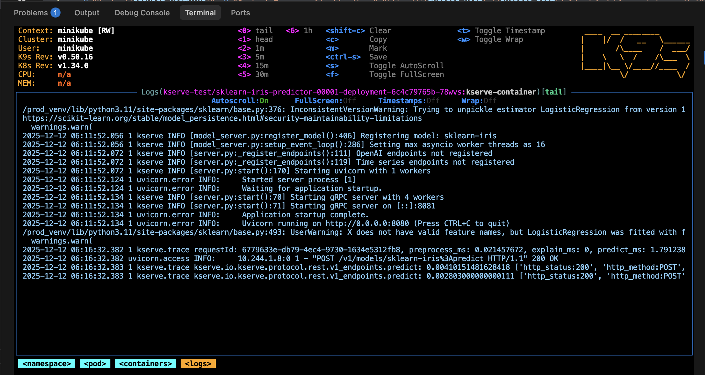

# Instructions

## Install Kubeflow

```bash
export PIPELINE_VERSION=2.14.3

kubectl apply -k "github.com/kubeflow/pipelines/manifests/kustomize/cluster-scoped-resources?ref=$PIPELINE_VERSION"
kubectl wait --for condition=established --timeout=60s crd/applications.app.k8s.io
kubectl apply -k "github.com/kubeflow/pipelines/manifests/kustomize/env/platform-agnostic?ref=$PIPELINE_VERSION"
```

Verify that the Kubeflow Pipelines UI is accessible by port-forwarding:

```bash
kubectl port-forward -n kubeflow svc/ml-pipeline-ui 8080:80
```



### Create new pipeline

Compile and run the pipeline (`pipeline.py`). It is configured to use:

- Endpoint: `http://minio-service.kubeflow.svc.cluster.local:9000`
- Bucket: `kubeflow-bucket-test`
- Key: `models/iris`

```bash
ptyhon -m venv venv
source venv/bin/activate
python -m pip install --upgrade pip
python -m pip install kfp
python pipeline.py
kfp pipeline create -p IrisProject pipeline.yaml
```





### Verify Minio Storage





## Install KServe

```bash
curl -s "<https://raw.githubusercontent.com/kserve/kserve/release-0.16/hack/quick_install.sh>" | bash
```

### Apply InferenceService

```bash
kubectl create namespace kserve-test
kubectl apply -f s3-secret.yaml -n kserve-test
kubectl apply -f sa-s3.yaml -n kserve-test
kubectl apply -f inferenceservice.yaml -n kserve-test
```

### Test KServe

```bash
minikube tunnel
sudo password

export INGRESS_PORT=$(kubectl -n istio-system get service istio-ingressgateway -o jsonpath='{.spec.ports[?(@.name=="http2")].port}') 

export INGRESS_HOST=$(kubectl -n istio-system get service istio-ingressgateway -o jsonpath='{.status.loadBalancer.ingress[0].ip}')

export SERVICE_HOSTNAME=$(kubectl get inferenceservice sklearn-iris -n kserve-test -o jsonpath='{.status.url}' | cut -d "/" -f 3) 

curl -v -H "Host: ${SERVICE_HOSTNAME}" -H "Content-Type: application/json" "http://${INGRESS_HOST}:${INGRESS_PORT}/v1/models/sklearn-iris:predict" -d @iris-input.json 
```





### Resources

- [KServe Getting Started](https://kserve.github.io/website/docs/getting-started/predictive-first-isvc)

- [Deploying Machine Learning Models with Kubeflow and KServe: A Comprehensive Guide](https://medium.com/@jushijun/deploying-machine-learning-models-with-kubeflow-and-kserve-a-comprehensive-guide-2e3d1449dc54)

- [Minikube-Kubeflow-ML-KServe-AWS-Project](https://github.com/shj37/Minikube-Kubeflow-ML-KServe-AWS-Project/blob/main/pipeline.py)

- [KServe YouTube](https://www.youtube.com/watch?v=TQypOccQ3lc&t=8s)

### Fast test

```bash
kubectl apply -n kserve-test -f - <<EOF
  apiVersion: "serving.kserve.io/v1beta1"
  kind: "InferenceService"
  metadata:
    name: "sklearn-iris"
  spec:
    predictor:
      model:
        modelFormat:
          name: sklearn
        storageUri: "gs://kfserving-examples/models/sklearn/1.0/model"
EOF
```
