# AWS EKS Setup Guide for Kubeflow & KServe

This guide builds upon your successful `nginx-server` EKS deployment to now run a full Machine Learning inference stack using Kubeflow and KServe.

## 1. Prerequisites & Tooling

Ensure you have the tools installed from the [nginx-server EKS guide](../nginx-server/aws-eks/setup-guide.md):

- `aws` CLI configured
- `eksctl`
- `kubectl`

## 2. Phase 1: Train Locally, Save to Cloud (Hybrid Approach)

To avoid high AWS costs, we will train the model using your existing local Minikube Kubeflow setup, but save the output to a real AWS S3 bucket.

1. **Create an S3 Bucket:**
   Go to the AWS Console and create a bucket (e.g., `my-unique-ml-bucket-123`) in `us-west-2`.

2. **Set up Local Kubeflow (Minikube):**

   Ensure your `kubectl` context is set to **minikube**:

   ```bash
   kubectl config use-context minikube
   ```

   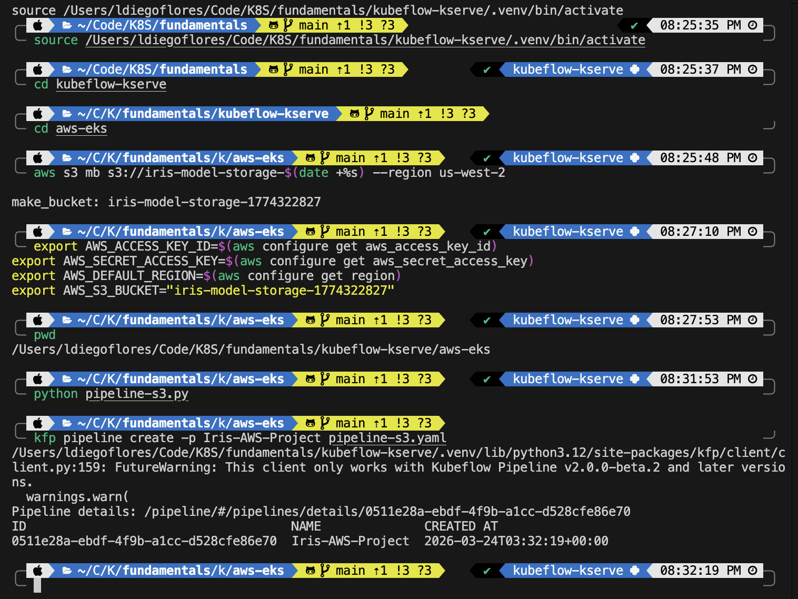

   Install the Kubeflow Pipelines manifests:

   ```bash
   export PIPELINE_VERSION=2.14.3

   kubectl apply -k "github.com/kubeflow/pipelines/manifests/kustomize/cluster-scoped-resources?ref=$PIPELINE_VERSION"
   kubectl wait --for condition=established --timeout=60s crd/applications.app.k8s.io
   kubectl apply -k "github.com/kubeflow/pipelines/manifests/kustomize/env/platform-agnostic?ref=$PIPELINE_VERSION"
   ```

3. **Set up Environment Variables (Locally):**

   Instead of editing the script directly, it's safer to use environment variables for your AWS credentials and S3 config:

   ```bash
   export AWS_ACCESS_KEY_ID=$(aws configure get aws_access_key_id)
   export AWS_SECRET_ACCESS_KEY=$(aws configure get aws_secret_access_key)
   export AWS_DEFAULT_REGION=$(aws configure get region)
   export AWS_S3_BUCKET="iris-model-storage-1774322827"
   ```

4. **Run the Pipeline on Minikube:**

   Now, navigate to the folder and run the pipeline creation:

   ```bash
   cd aws-eks
   python pipeline-s3.py
   kfp pipeline upload -p "Iris-AWS-Hybrid" pipeline-s3.yaml
   ```

   Run the pipeline in the local UI and verify the `model.joblib` file appears in your real AWS S3 bucket.

   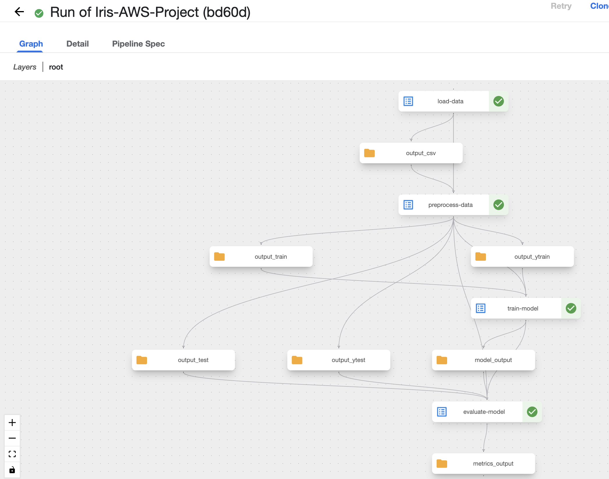

---

## 3. Phase 2: Create the EKS Cluster (Serving Only)

**IMPORTANT (FREE TIER USERS):** If this is a new AWS account, you MUST click **"Upgrade plan"** in your AWS Billing Console. AWS restricts larger instances (like `medium`) on the "Free Plan" even if you have credits. Upgrading is free and uses your credits first.

### Cleanup old/failed groups (If needed)

If your first try timed out, delete the "phantom" group before trying again:

```bash
eksctl delete nodegroup --cluster kserve-test --name kserve-workers --region us-west-2 --drain=false
```

### Create the Cluster with Medium Nodes

We use `t3.medium` because KServe and Istio require at least 4GB of RAM per node to run reliably.

```bash
eksctl create cluster \
  --name kserve-test \
  --region us-west-2 \
  --version 1.34 \
  --nodegroup-name kserve-workers-medium \
  --node-type t3.medium \
  --nodes 2 \
  --managed
```

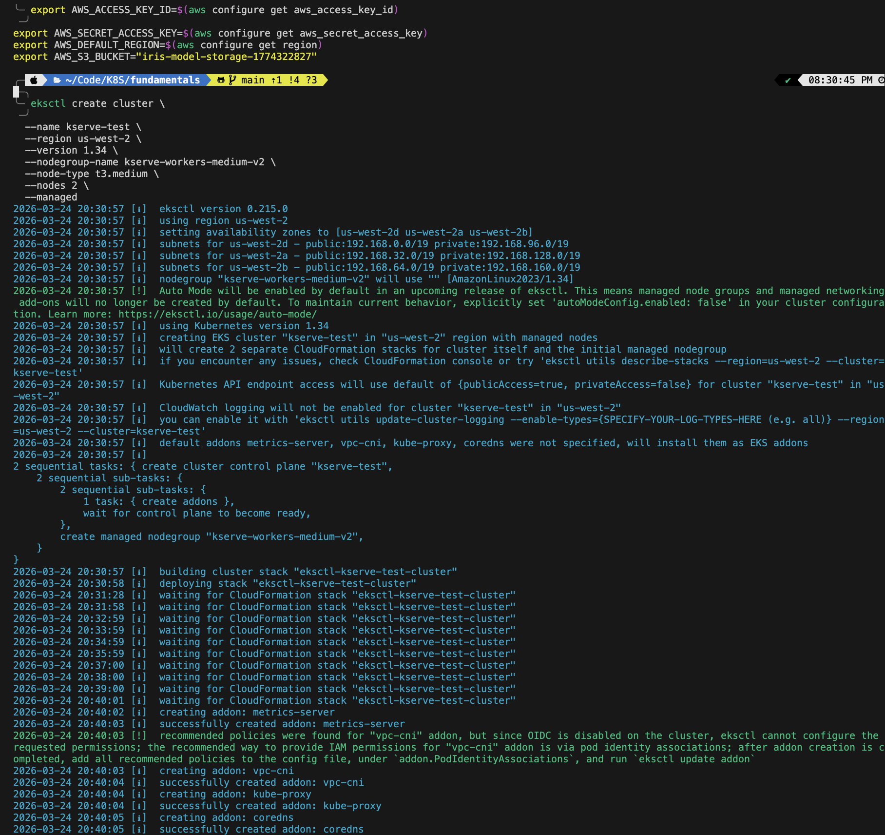

---

## 4. Install KServe (Stand-alone)

KServe only requires Istio and Cert-Manager to serve models. The quick install script handles this perfectly without the rest of the Kubeflow bloat:

```bash
curl -s "https://raw.githubusercontent.com/kserve/kserve/release-0.16/hack/quick_install.sh" | bash
```

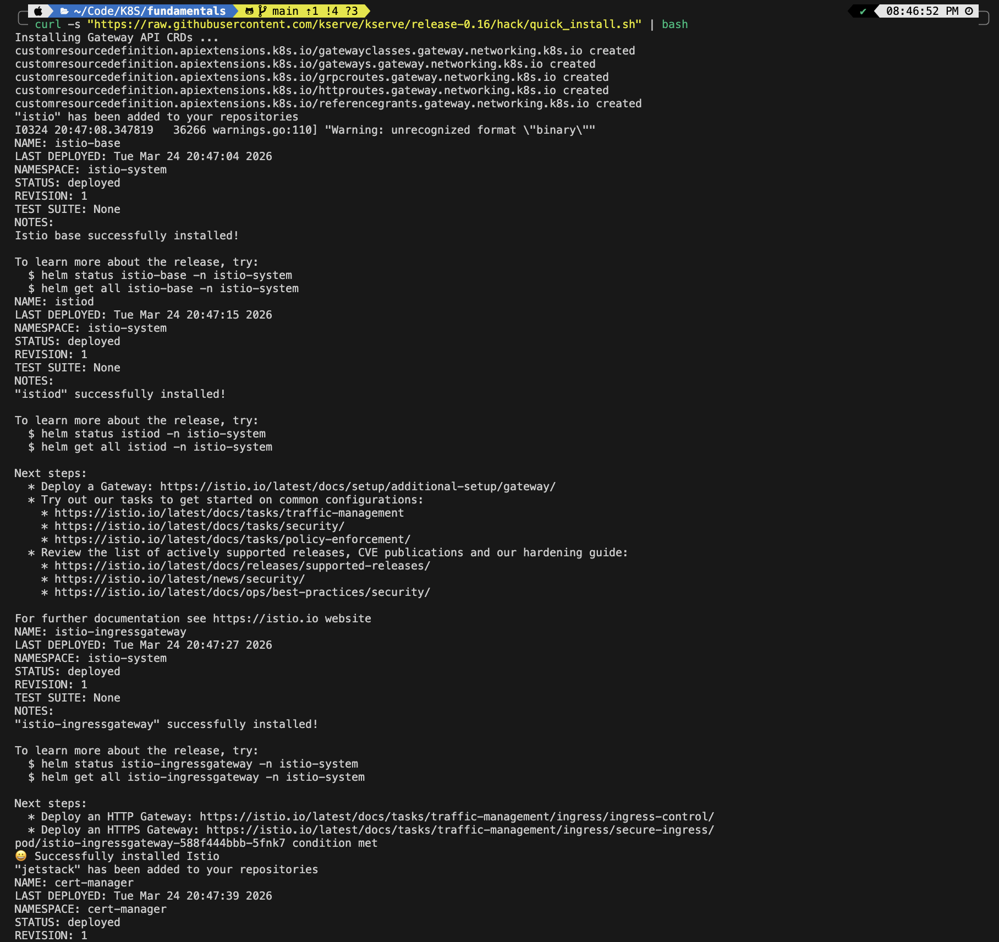
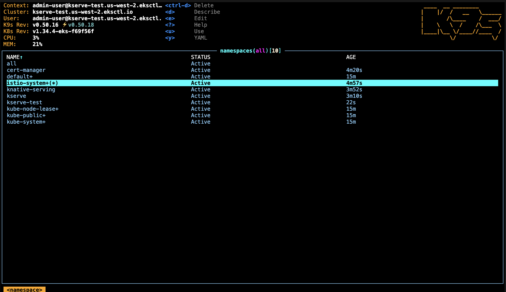

## 5. Deploy the Iris Model from S3

Now we will tell KServe to pull the model you trained in Phase 1 directly from S3.

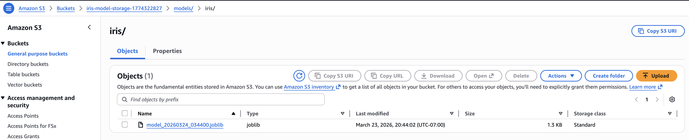

1. **Create Namespace**:

   ```bash
   kubectl create namespace kserve-test
   ```

2. **Dynamically Inject AWS Credentials**:
   Since you already exported `$AWS_ACCESS_KEY_ID` and `$AWS_SECRET_ACCESS_KEY` in your terminal during Phase 1, you can create the Kubernetes secret directly via the CLI without saving your keys into a file:

   ```bash
   # Create the base secret directly from your environment variables
   kubectl create secret generic s3-secret \
     -n kserve-test \
     --from-literal=AWS_ACCESS_KEY_ID=${AWS_ACCESS_KEY_ID} \
     --from-literal=AWS_SECRET_ACCESS_KEY=${AWS_SECRET_ACCESS_KEY}
   
   # Add the required KServe annotations to the secret
   kubectl annotate secret s3-secret -n kserve-test \
     serving.kserve.io/s3-endpoint=s3.${AWS_DEFAULT_REGION}.amazonaws.com \
     serving.kserve.io/s3-usehttps="1" \
     serving.kserve.io/s3-region=${AWS_DEFAULT_REGION}

   # Apply the ServiceAccount that links to this secret
   kubectl apply -f s3-sa.yaml
   ```

   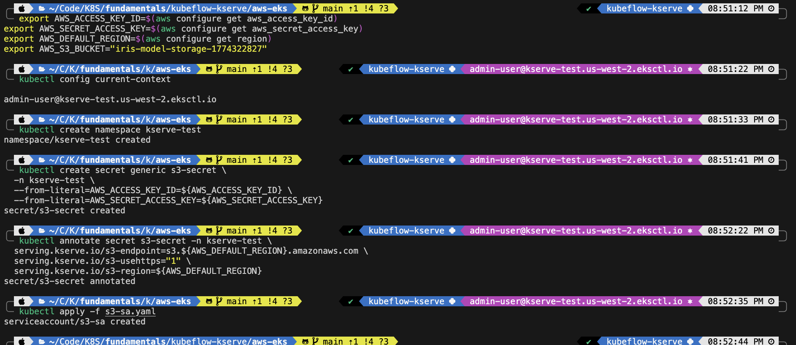

3. **Deploy the InferenceService**:
   While the secrets were injected dynamically, it is a great practice to keep your deployment configurations in version control.

   Open `inferenceservice.yaml` and update the `storageUri` to match your actual S3 bucket name (e.g., `s3://my-unique-ml-bucket-123/models/iris`). Apply it:

   ```bash
   kubectl apply -f inferenceservice.yaml
   ```

   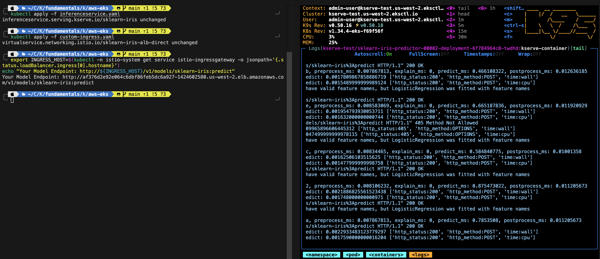

## 6. Access from frontend-iris (End-to-End Cloud Native)

To make this a true "End-to-End" architecture, we will host the Frontend application natively within the EKS cluster using an Nginx pod alongside your KServe model.

### 1. Deploy the Frontend Application
Navigate to the frontend folder and bundle the HTML/JS/CSS files into a Kubernetes ConfigMap, then deploy the Nginx server.

```bash
cd ../frontend-iris

# 1. Package the UI files into a ConfigMap
kubectl create configmap frontend-files -n kserve-test \
  --from-file=index.html --from-file=app.js --from-file=style.css \
  --dry-run=client -o yaml | kubectl apply -f -

# 2. Deploy the Nginx Frontend Server
kubectl apply -f frontend-deployment.yaml
```

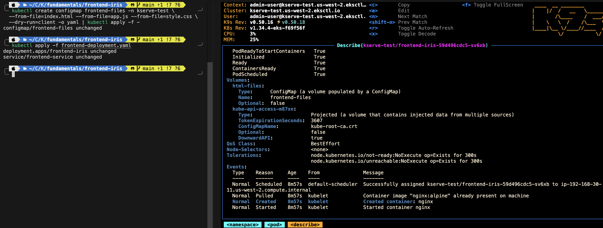

### 2. Configure Unified Web Routing
Apply the custom Istio **VirtualService** that tells the AWS Load Balancer to route traffic to your Frontend for normal web requests (`/`), and seamlessly pass API predictions to your KServe model (`/v1/...`).

```bash
# Return to the AWS folder and apply the Istio routing
cd ../kubeflow-kserve/aws-eks
kubectl apply -f custom-ingress.yaml
```

### 3. Get the Load Balancer URL
Grab your public EKS URL:
```bash
export INGRESS_HOST=$(kubectl -n istio-system get service istio-ingressgateway -o jsonpath='{.status.loadBalancer.ingress[0].hostname}')
echo "Your End-to-End App is live at: http://${INGRESS_HOST}/"
```

### 4. Test It Live!
1. Open your browser and navigate to the **Load Balancer URL** we grabbed above.
2. Because everything runs on the same domain natively, there is no need to configure endpoints or proxies.
3. Enter your measurements and click **Predict Species** to witness full cross-container cloud inference!

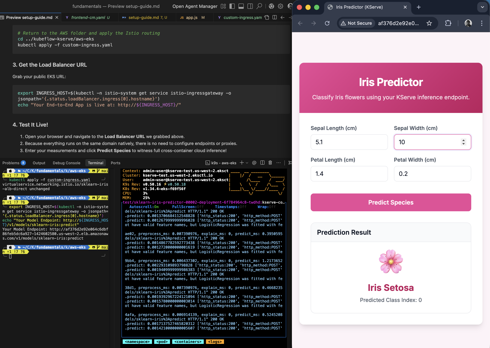
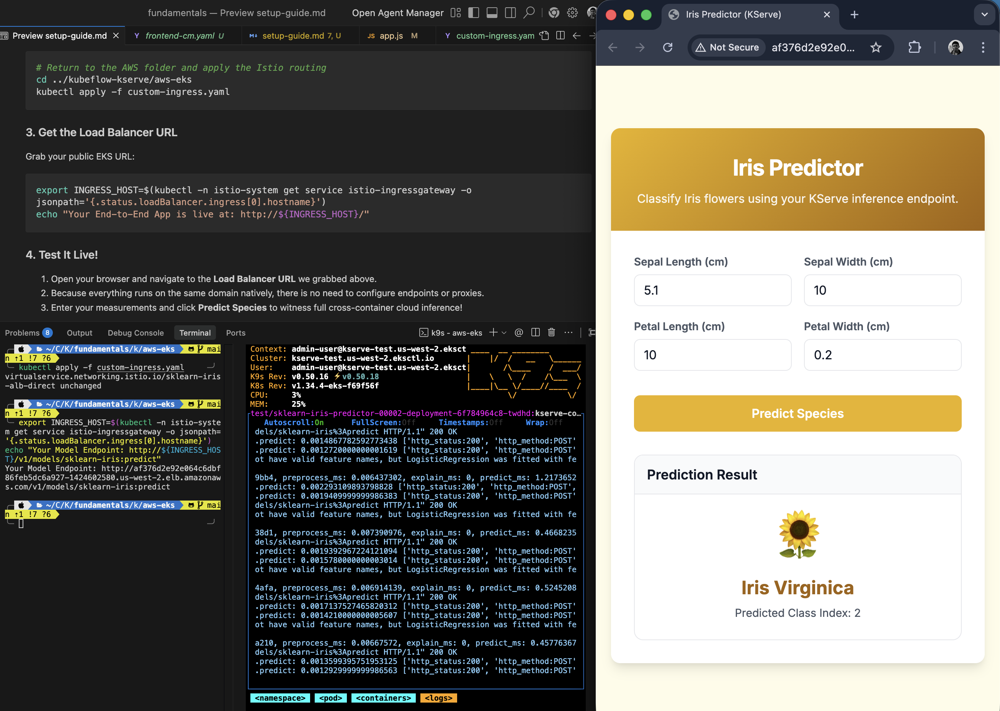

---

## 7. Clean Up (IMPORTANT!)

To stop paying for resources, delete the cluster when you are finished testing.

```bash
eksctl delete cluster --name kserve-test --region us-west-2
```

Wait for confirmation that the cluster is deleted.
