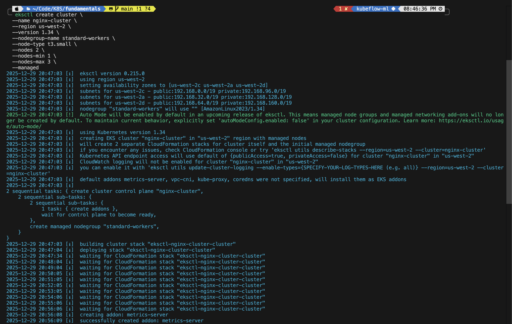
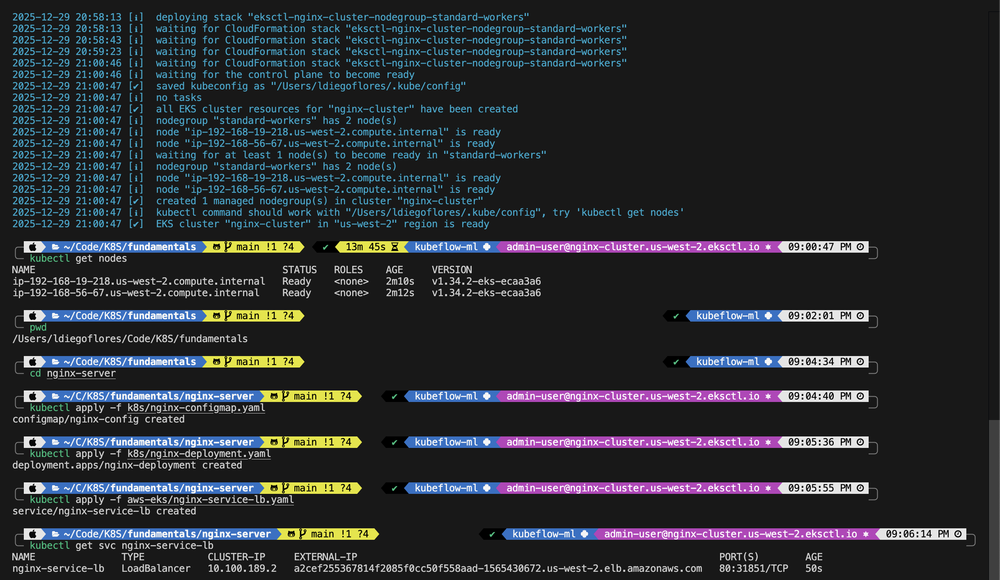
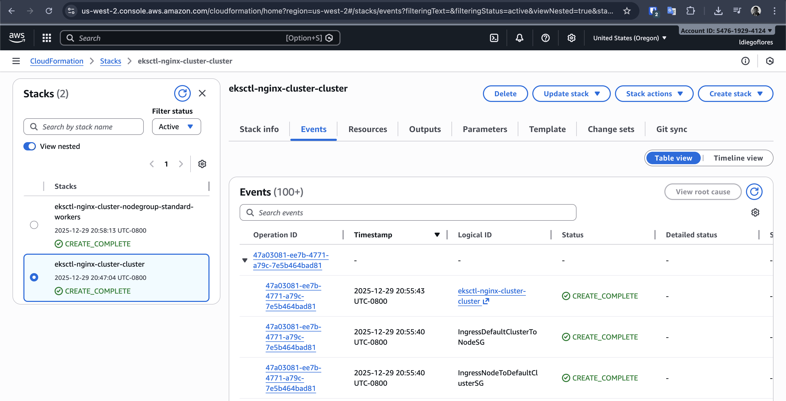
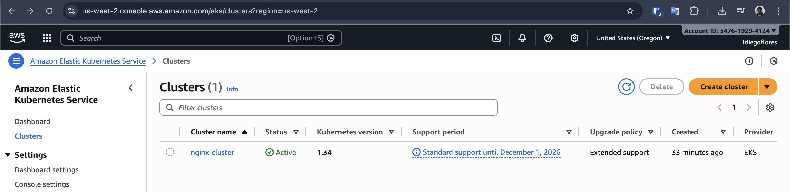
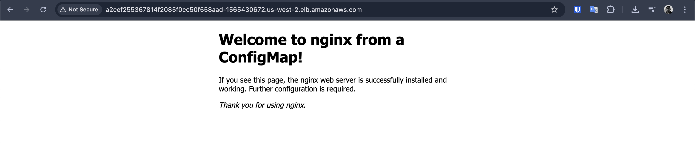

# AWS EKS Setup Guide for macOS

This guide walks you through setting up your environment to deploy Kubernetes applications on AWS Elastic Kubernetes Service (EKS) using the AWS Free Tier where possible.

## Prerequisites

You will need a terminal on your MacBook. We will use Homebrew for installing tools.

## 1. AWS Account Setup

1. **Create an AWS Account**: If you don't have one, go to [aws.amazon.com](https://aws.amazon.com/) and sign up. You will need a credit card, but we will aim to stay within the Free Tier.
2. **Root User vs. IAM User**: After creating the account, it is best practice NOT to use the root account for daily tasks.
    * Log in as Root.
    * Go to **IAM** (Identity and Access Management) in the AWS Console.
    * Create a user (e.g., `admin-user`).
    * Attach the `AdministratorAccess` policy (for learning purposes; in production, use least privilege).
    * Create **Access Keys** for this user (Security Credentials tab -> Create access key -> Command Line Interface (CLI)).
    * **IMPORTANT**: Download the `.csv` file or copy the `Access Key ID` and `Secret Access Key`. You won't see the secret again.

## 2. Tool Installation (macOS)

We need three main tools:

* `aws` CLI: To interact with AWS.
* `eksctl`: The official CLI for Amazon EKS (makes creating clusters very easy).
* `kubectl`: To talk to the Kubernetes cluster (you might already have this from minikube, but ensure it's up to date).

Run these commands in your terminal:

```bash
# 1. Install AWS CLI
brew install awscli

# 2. Install eksctl
brew tap aws/tap
brew install aws/tap/eksctl

# 3. Install kubectl (if not already installed or to update)
brew install kubectl
```

## 3. Configure AWS CLI

Now, link your terminal to your AWS account.

```bash
aws configure
```

It will ask for:

* **AWS Access Key ID**: Paste your key from Step 1.
* **AWS Secret Access Key**: Paste your secret key from Step 1.
* **Default region name**: `us-west-2` (North Virginia) is often a good default, or `us-west-2` (Oregon). Pick one and stick to it.
* **Default output format**: `json`

Test it:

```bash
aws sts get-caller-identity
```

You should see your user details.

## 4. Create an EKS Cluster

We will use `eksctl` to create a simple cluster.

**Warning on Cost**: EKS Control Plane usage costs ~$0.10/hour (~$72/month). It is NOT part of the Free Tier. The EC2 nodes (t3.micro or t3.small) can be part of the Free Tier if you are eligible. **Remember to delete the cluster when done to avoid unexpected charges.**

Command to create a small cluster:

```bash
eksctl create cluster \
  --name nginx-cluster \
  --region us-west-2 \
  --version 1.34 \
  --nodegroup-name standard-workers \
  --node-type t3.small \
  --nodes 2 \
  --nodes-min 1 \
  --nodes-max 3 \
  --managed
```



* `--name`: Name of your cluster.
* `--region`: Must match your `aws configure` region.
* `--node-type t3.small`: `t3.small` is good for testing. `t3.micro` is Free Tier eligible but might be too small for K8s system pods + your app.
* `--managed`: Uses EKS Managed Node Groups.

This process takes **15-20 minutes**. Grab a coffee! ☕



You can also check the progress in the AWS CloudFormation console, as `eksctl` uses it under the hood:


And verify the cluster is active in the EKS Console:


## 5. Connect kubectl to EKS

Once the cluster is ready, `eksctl` usually updates your `~/.kube/config` automatically. If not, run:

```bash
aws eks update-kubeconfig --region us-west-2 --name nginx-cluster
```

Verify connection:

```bash
kubectl get nodes
```

You should see your AWS EC2 nodes.

## 6. Deploy Nginx Server

Now you can use your existing Kubernetes manifests!

```bash
# Navigate to your aws-eks folder
cd /path/to/nginx-server/aws-eks

# Apply files
kubectl apply -f ../k8s/nginx-configmap.yaml
kubectl apply -f ../k8s/nginx-deployment.yaml
# Use the LoadBalancer service for AWS to get a public IP
kubectl apply -f nginx-service-lb.yaml
```

**Note on LoadBalancer**:
We used `nginx-service-lb.yaml` which uses `type: LoadBalancer`. AWS will provision an Elastic Load Balancer (ELB). This allows you to access the nginx server from the internet. This costs money (prorated hourly).


To check the external IP/DNS:

```bash
kubectl get svc nginx-service-lb
```

Look for the `EXTERNAL-IP`. It will be a long AWS URL (e.g., `a1b2c3...us-west-2.elb.amazonaws.com`). Open that in your browser.



## 7. Clean Up (IMPORTANT!)

To stop paying for resources, delete the cluster when you are finished testing.

```bash
# Delete the Service first (to delete the Load Balancer)
kubectl delete -f nginx-service-lb.yaml

# Delete the Cluster
eksctl delete cluster --name nginx-cluster --region us-west-2
```

Wait for confirmation that the cluster is deleted.
