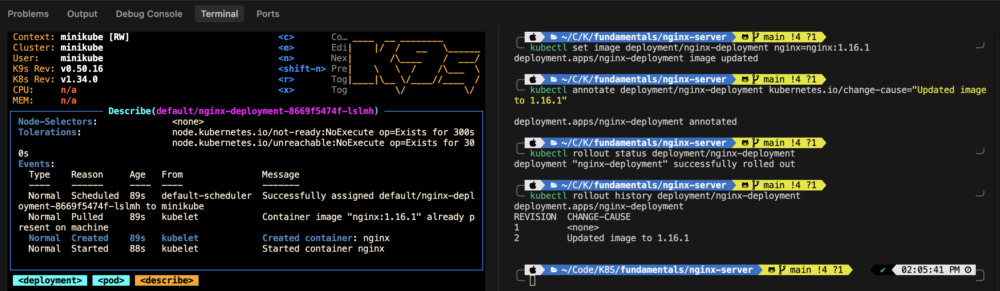
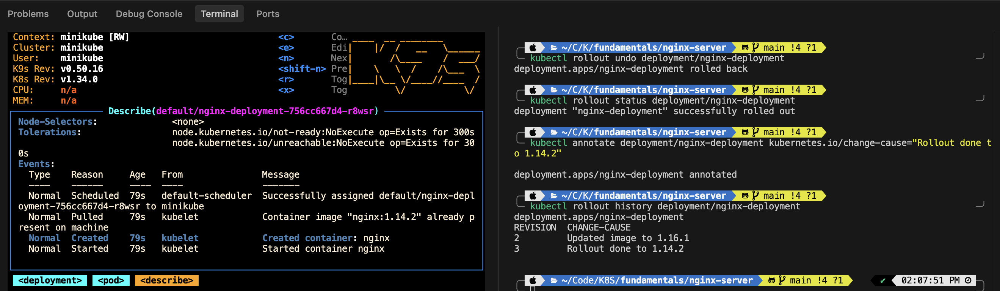

# Nginx Rolling Update Task

## Goal

Apply a Rolling Update strategy to the Nginx deployment and understand how to manage rollouts.

## Strategy Explanation

This configuration defines how Kubernetes handles updates to your application (like when you change the Docker image version). Here is the breakdown of what each line does:

* **`type: RollingUpdate`**: This is the strategy used to replace old Pods with new ones. Instead of killing all old Pods at once (which would cause downtime), it replaces them gradually.
* **`maxSurge: 1`**: This allows Kubernetes to create **1 extra Pod** above your desired count during the update.
  * *In your case (1 replica):* It allows a second Pod (the new version) to start up before the old one is removed, helping to avoid downtime.
* **`maxUnavailable: 1`**: This specifies that **1 Pod** can be unavailable during the update process.
  * *In your case:* This means Kubernetes is allowed to take down your single running Pod to perform the update.

**In Summary:**
This configuration tells Kubernetes: "When I update my app, you are allowed to start 1 new Pod immediately (`maxSurge`), and you are allowed to take down 1 old Pod (`maxUnavailable`) to make the switch happen."

## 1. Apply the Deployment

Apply the updated deployment manifest which includes the `RollingUpdate` strategy.

```bash
kubectl apply -f ../nginx-deployment.yaml
```

## 2. Trigger a Rollout

To verify the rolling update, update the image to a different version.

```bash
kubectl set image deployment/nginx-deployment nginx=nginx:1.16.1
```

## 3. Check Rollout Status

Monitor the progress of the rolling update.

```bash
kubectl rollout status deployment/nginx-deployment
```

## 4. Rollback a Change

If there is an issue with the new version, rollback to the previous revision.

```bash
kubectl rollout undo deployment/nginx-deployment
```

## 5. Check Rollout History

View the history of rollouts.

```bash
kubectl rollout history deployment/nginx-deployment
```

## 📸 Evidence

Here are the screenshots capturing the lifecycle of our deployment:

### 1. Initial Deployment


### 2. Rolling Update (Upgrade)



### 3. Rollback Action


